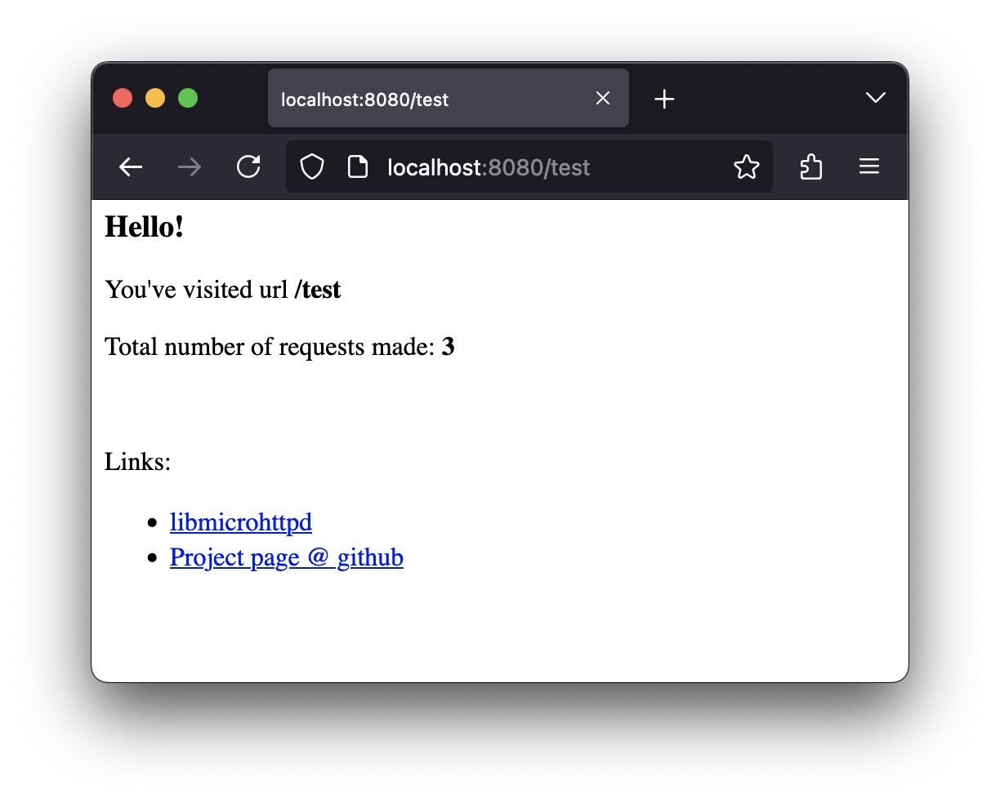

# Kotlin/Native web server

A simple proof of concept of Kotlin/Native app with a web server inside (C interop for [libmicrohttpd](https://www.gnu.org/software/libmicrohttpd/))

## Status

* MacOS: ✅
* Linux: TODO
* Windows: TODO

## Requirements

* This is a gradle project with wrapper included, so you only need installed JRE for gradle to be able to run tasks
* Download, build and install [libmicrohttpd](https://www.gnu.org/software/libmicrohttpd/). Instruction in [here](https://github.com/ulion/libmicrohttpd/blob/master/INSTALL). I've used only `./configure; make; make install` without any flags or manual configuration.

## Build

After installing all requirements:

1. Open src/nativeInterop/libmicrohttpd.def
2. Look through your /usr and /opt dirs for libmicrohttpd installation artifacts, make sure:
   * Path to folder containing microhttpd.h is specified at `compilerOpts`
   * Path to folder containing libmicrohttpd.a is specified at `libraryPaths`
3. `./gradlew linkReleaseExecutableNative`

## Run

After building run `./build/bin/native/releaseExecutable/kotlin-native-web-server.kexe` (for MacOS). Output:
```
Server is listening port 8888
Press enter to stop
```
Open link http://localhost:8888/any-url in browser:


